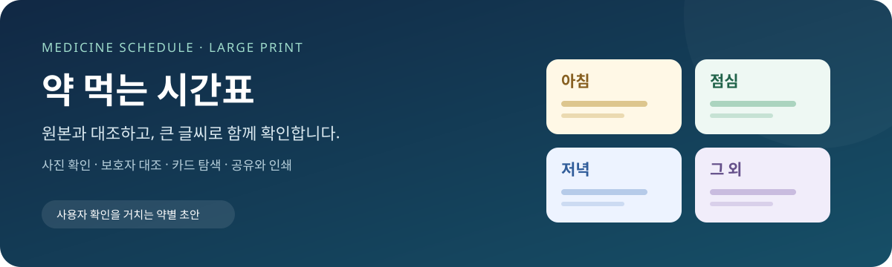
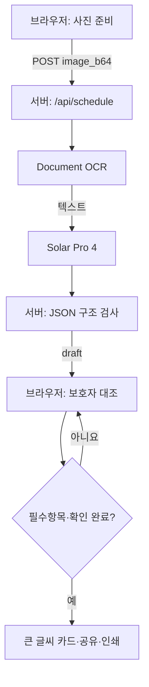

<div align="center">

# 약 먹는 시간표

**약봉투 사진에서 추출한 내용을 보호자가 원본과 대조·수정한 뒤, 큰 글씨 시간표로 보고 공유·인쇄하는 웹서비스입니다.**

[서비스 사용하기](https://medschedule-largeprint.vercel.app/) · [사용 방법](#사용-방법) · [기술 구성](#기술-스택과-선택-이유) · [검증 상태](#검증-상태와-다음-확인)

`medicine-schedule-largeprint` · `Solar Pro 4` · `Document OCR` · `Vercel`

</div>

> 배너는 서비스 개념을 설명하는 일러스트이며 실제 화면 캡처가 아닙니다. 이 문서는 최신 검토 기능을 설명하며, 운영 사이트의 반영 여부는 배포 버전에 따라 다를 수 있습니다.

## 핵심 요약 — 심사에서 보여주고 싶은 세 가지

- **읽기 쉬운 결과:** 작은 약봉투 글씨를 아침·점심·저녁·그 외의 큰 글씨 카드로 정리합니다.
- **사용자 확인을 거치는 AI:** 추출 초안을 원본과 대조·수정하고, 약별 확인과 전체 확인을 마쳐야 결과를 열 수 있습니다.
- **가족에게 전달하기 쉬운 흐름:** 별도 회원가입·앱 설치 없이 웹에서 확인하고 텍스트 공유·복사·인쇄로 전달합니다.

## 기획 배경과 문제 정의

약봉투에는 약 이름, 1회량, 횟수, 복용 조건 등 여러 정보가 작은 글씨로 모여 있습니다. 이를 읽기 어려운 사용자는 가족의 도움을 받아 다시 정리해야 합니다. 단순히 글자를 크게 만드는 것뿐 아니라, 어떤 약을 언제 먹는지 확인하고 가족에게 전달하는 과정도 필요합니다.

이 프로젝트는 **“약봉투를 읽기 어려운 사용자와 보호자의 정보 확인 부담을 줄이자”**는 문제에서 출발했습니다. AI가 내용을 초안으로 추출하고, 보호자가 원본을 보며 수정한 뒤 큰 글씨 결과로 전달하는 흐름을 제공합니다.

공모전에서는 Solar 기반 스킬을 일상 문제 해결에 적용하는 사례로 제시합니다. 접근성, 보호자 참여, 결과의 재사용을 기획의 중심에 두었습니다. 이는 프로젝트의 주제 연결 설명이며, 공식 심사 기준을 인용한 것은 아닙니다.

> **서비스의 경계**  
> 복용 방법을 새로 결정하거나 효능·부작용·병용 판단을 제공하지 않습니다. 사용자 확인은 의료 전문가의 검토를 대신하지 않습니다. 불명확한 복용 방법은 약사에게 확인해야 합니다.

## 주요 기능

| 기능 | 사용자가 할 수 있는 일 | 구현 포인트 |
| :--- | :--- | :--- |
| 사진 선택·촬영 | 저장된 사진 선택 또는 카메라 사용 요청 | 사진 선택만으로 분석하지 않음 |
| 방향 확인·확대 | 원본을 확대하고 좌우로 90도 회전 | 최초 디코딩 원본을 유지해 반복 회전 |
| 사진 최적화 | 큰 사진을 변환해 미리보기·분석에 사용 | 긴 변 최대 2400px, JPEG 품질 0.9, 작은 사진 확대 없음 |
| 약별 대조·수정 | 약명·1회량·횟수·조건·며칠분·유형 수정 | OCR 근거를 함께 표시 |
| 누락 안내 | 입력·시간대·확인란의 누락 위치 확인 | 관련 항목에 오류 표시, 수정 후 갱신 |
| 큰 글씨 시간표 | 시간대별로 확인한 약 보기 | 아침·점심·저녁·그 외 네 카드 |
| 공유·복사·인쇄 | 확인한 내용을 가족에게 전달 | 텍스트 공유, 수동 복사 대안, 전체 카드 인쇄 |

### 시간대별 결과 구성

| 아침 | 점심 | 저녁 | 그 외 |
| :---: | :---: | :---: | :---: |
| 확인한 아침 약 | 확인한 점심 약 | 확인한 저녁 약 | 자기 전·필요시·비매일 약 |

데스크톱에서는 사진과 수정 화면을 나란히 배치하고 사진 영역을 고정합니다. 모바일에서는 세로 배치와 결과 카드 가로 탐색을 사용합니다. 아래 실제 화면 자료는 검증 후 추가할 예정입니다.

| 추가 예정인 화면 자료 | 보여줄 내용 |
| :--- | :--- |
| 사진 미리보기 | 촬영 안내·확대·회전 |
| 보호자 확인 화면 | 입력 오류 표시·약별 확인 |
| 큰 글씨 카드 | 네 시간대의 탐색 |
| 인쇄 미리보기 | 네 카드와 안내문 출력 |

실제 캡처나 GIF가 준비되지 않은 상태에서 화면 검증을 완료한 것으로 표시하지 않습니다.

### 복용 조건은 선택 입력

복용 조건 입력에는 회색 예시 `식전/식후 등`이 표시되고, 입력 아래에 생략 안내가 유지됩니다. 예시 문구는 실제 데이터로 저장하지 않습니다.

- 조건을 입력하면 원문 그대로 결과에 표시합니다.
- 빈 값이나 공백뿐이면 **복용 조건: 별도 입력 없음**으로 표시합니다.
- 이는 ‘조건 없음’ 또는 ‘조건 확인 완료’를 뜻하지 않습니다.
- 필요시·비매일 약도 조건을 비워 둘 수 있으므로, 생략된 조건은 원본에서 별도로 확인해야 합니다.

약 이름·1회량, 매일 복용 약의 횟수·시간대 등 다른 필수 검사는 유지됩니다. 근거의 초기 선택만으로 확인 완료되지 않습니다. 약별 확인 체크 시 근거를 보호자 확인 상태로 바꾸며, 필수값을 자동으로 채우지 않습니다.

전체 확인에서는 입력 내용·선택 시간대·빠진 약과 미입력 조건의 생략 사실을 사용자가 확인합니다. 수정 시 관련 확인과 기존 결과는 해제되며, 복용 조건·횟수·유형 변경 시 관련 시간대와 근거도 초기화합니다.

### 공유와 인쇄

공유는 현재 **텍스트 방식**입니다. 지원되는 기기의 공유 기능과 클립보드 복사를 사용하며, 자동 복사 실패 시 수동 복사용 텍스트를 제공합니다.

인쇄에서는 네 카드를 세로로 펼치고 사진·편집란·조작 버튼·공유 미리보기를 제외합니다. 원본 대조 및 약사 문의 안내는 결과·공유문·인쇄물에 포함됩니다. 약 개수와 인쇄 설정에 따라 여러 장이 될 수 있으며, A4 한 장 출력을 보장하지 않습니다.

카드 이미지 공유, 공유 링크 발급, 복약 알림, 복용 완료 기록은 현재 구현 범위에 포함되지 않습니다.

## 시연과 데모

**[배포 서비스 열기](https://medschedule-largeprint.vercel.app/)**

- 테스트 계정: 불필요 — 회원가입 없이 사용합니다.
- 시연 영상: 준비 중. YouTube 일부 공개 영상 제작 후 링크를 추가할 예정입니다.
- 시연 자료: 개인정보가 없는 시험용 약봉투 이미지 사용을 권장합니다.

### 사용 방법

1. **저장된 사진 선택** 또는 **사진 찍기**를 누릅니다.
2. 미리보기에서 방향·선명도를 확인하고 필요하면 회전합니다.
3. **이 사진으로 읽기**를 눌러 초안을 만듭니다.
4. 원본과 약별 입력 내용·시간대·문서 확인 사항을 대조합니다.
5. 약별 확인과 전체 확인을 완료합니다.
6. **큰 글씨 시간표 보기**에서 카드를 탐색합니다.
7. 필요하면 공유·복사하거나 **인쇄 / 저장**을 사용합니다.

카메라 호출과 지원 이미지 형식, 공유 및 PDF 저장은 기기·브라우저에 따라 다릅니다.

## 기술 스택과 선택 이유

| 기술 | 역할 | 이 프로젝트에 적합한 이유 |
| :--- | :--- | :--- |
| HTML·CSS·JavaScript | 반응형 화면과 상태 관리 | 별도 앱 설치 없이 웹으로 접근 |
| Canvas API | 사진 회전·축소·JPEG 변환 | 서버 전송 전에 기기에서 사진을 준비 |
| Upstage Document OCR | 이미지의 텍스트 추출 | 이미지 판독과 약별 정보 정리를 분리 |
| Solar Pro 4 | OCR 텍스트에서 구조화 초안 추출 | 약별 필드와 근거를 JSON으로 받아 검토 화면에 연결 |
| Node.js·form-data | 서버 요청·OCR 파일 전송 | API 키를 서버에 두고 같은 도메인의 API로 연결 |
| Vercel | 정적 페이지·서버리스 함수 배포 | 화면과 API를 하나의 서비스 주소로 구성 |

분석 요청에는 화면 측 90초 시간 제한과 종료 시 타이머 정리가 적용됩니다. 작업 번호로 오래된 응답을 구분하고 처리 중 중복 조작을 제한합니다. 서버 Solar 호출은 별도의 45초 중단 타이머를 사용하며, 이는 배포 플랫폼의 실행 제한을 늘리는 설정이 아닙니다.

## 시스템 아키텍처와 구조



| 경로 | 역할 |
| :--- | :--- |
| `index.html` | 사진 처리·수정·확인·결과 화면 |
| `api/schedule.js` | OCR 및 Solar 호출·구조 검사·응답 |
| `package.json` | 서버 의존성 선언 |
| `README.md` | 프로젝트 안내 |
| `docs/assets/readme-banner.svg` | README 소개 배너 |

현재 코드에는 데이터베이스 저장 기능이 없으므로 ERD는 없습니다. 운영 서버 및 외부 API의 로그·보관 정책과는 별개입니다.

### API 명세

`POST /api/schedule` · `Content-Type: application/json`

```json
{ "image_b64": "data:image/jpeg;base64,..." }
```

| 응답 | 형태 |
| :--- | :--- |
| 성공 | `{ "draft": { "medications": [], "document_issues": [], "extraction_status": "partial" } }` |
| 실패 | `{ "error": "오류 안내" }` |

위 성공 예시는 키 구조 설명용이며, 빈 약 목록은 실제 서버 검사에서 거부됩니다.

약별 초안은 `id`, `name`, `dose`, `frequency`, `timing`, `duration`, `schedule_type`, `time_slots`를 포함합니다. 다섯 추출 필드는 `value`, `evidence`, `status`로 구성됩니다. 상태는 `found` 또는 `unresolved`, 시간대는 `morning`, `noon`, `evening`, `bedtime`을 사용합니다.

현재 요청 핸들러는 `extractMedicationDraft`를 사용합니다. 서버 파일에 남은 구형 `PROMPT`와 `solarSchedule`은 현재 호출 경로가 아닙니다.

### 추출과 검증의 경계

프롬프트는 약명·숫자·단위를 추측하지 않고, 횟수만으로 시간대를 지정하지 않으며, 미확인 내용을 원본에 없는 것으로 단정하지 않도록 지시합니다. 개인정보와 의학적 판단을 출력하지 않도록 지시합니다.

서버는 JSON 구조, 필드 상태, 허용 시간대, 중복 항목과 응답 종료 상태를 검사합니다. **프롬프트와 구조 검사는 OCR 정확성·의학적 정확성·개인정보 제거를 보장하지 않습니다.**

## 설치 및 실행 방법

### 요구 사항

- Windows·macOS·Linux에서 Node.js, npm, Git 및 Vercel CLI 사용 환경
- 이 프로젝트의 문법·가짜 응답 검사 환경: **Node.js 24.19.0**
- 서버 의존성: `form-data ^4.0.0`
- Upstage API 키: `SOLAR_PRO_API_KEY`
- 최신 브라우저 권장. 전체 OS·브라우저 조합을 검증한 것은 아닙니다.

```bash
git clone https://github.com/lythean1004/medschedule-largeprint.git
cd medschedule-largeprint
npm install
```

<details>
<summary><strong>서버 환경변수와 로컬 실행 설정</strong></summary>

1. Vercel CLI가 없다면 `npm install -g vercel`로 설치합니다.
2. 프로젝트를 Vercel에 연결하고 `SOLAR_PRO_API_KEY`를 필요한 환경에 등록합니다.
3. 로컬에서도 해당 서버 환경변수를 사용할 수 있도록 구성합니다.
4. `vercel dev`로 화면과 API를 함께 실행합니다.

API 키가 들어간 환경 파일은 GitHub에 올리지 마세요. `index.html`만 직접 열어서는 같은 도메인의 서버 API 연결을 검사할 수 없습니다. 현재 `package.json`에는 별도의 시작·빌드·테스트 스크립트가 없습니다.

</details>

### 배포

저장소의 `index.html`과 서버 파일을 Vercel 프로젝트에 배포합니다. `SOLAR_PRO_API_KEY`를 서버 환경에 설정하고 배포 완료 상태를 확인합니다. README 갱신은 앱 코드 갱신을 대신하지 않습니다.

## 검증 상태와 다음 확인

| 항목 | 현재 확인 범위 |
| :--- | :--- |
| 스크립트 문법 | 최신 검토 코드 파싱 통과 |
| 조건 선택 입력·공백 처리 | 가짜 상태로 확인·공유 함수 검사 |
| 회색 설명 표시 | 복용 유형·입력값별 유지, 중복·제거 검사 |
| 회전·축소 | 가짜 캔버스·변환 함수 검사 |
| 요청 시간 초과 | 가짜 응답·타이머로 성공·실패·본문 대기 검사 |
| 결과 카드·인쇄 호출 | 앞선 검토 코드의 가짜 DOM·호출 검사 |
| 실제 OCR·모바일·인쇄창 | 이 문서에서 전체 통과를 주장하지 않음 |

위 검사는 저장소에 자동화 테스트 묶음이 포함돼 있다는 의미가 아닙니다. 사진 축소의 해상도 제한은 전송 바이트 크기를 보장하지 않으며, 원본 디코딩의 메모리 사용도 남아 있습니다.

<details>
<summary><strong>배포 후 직접 확인할 점검표</strong></summary>

- [ ] 데스크톱 파일 선택창과 실제 사진 분석
- [ ] 회전·축소 후 작은 글씨의 판독 품질
- [ ] 필수값 누락 표시와 약별·전체 확인
- [ ] 빈 조건의 ‘별도 입력 없음’ 표시
- [ ] 내용 수정 후 결과 무효화·재확인
- [ ] 아이폰·안드로이드 촬영 및 이미지 형식 지원
- [ ] 320px·390px에서 버튼·입력창 잘림 없음
- [ ] 카드 스크롤·이전·다음·시간대 바로가기
- [ ] 공유 성공·취소·수동 복사 대안
- [ ] 인쇄 미리보기와 PDF의 네 카드·안내문
- [ ] 배포 환경의 요청 본문 크기·실행 시간 제한

</details>

## 팀원 소개

### 박&#8288;도&#8288;현 · 1인 프로젝트

**기획부터 개발·검토·배포까지 직접 총괄했습니다.**

- **기획:** 문제 정의, 보호자 중심 사용자 흐름과 접근성 설계
- **개발:** Timely AI의 Solar Pro 4를 직접 활용한 기능 구현과 반복 수정
- **추출 설계:** 약별 구조화 초안, 원문 근거 및 미확인 상태 처리 규칙 설계
- **품질 관리:** 입력·확인·공유·인쇄 흐름 검토와 배포 관리
- **개인정보 보호 설계:** 자체 영구 저장을 두지 않는 처리 방식, 추출 결과의 개인정보 제외 지시, 공유·인쇄 대상 제한

실제 사용자 평가 및 복약 오류 감소 효과는 검증 완료된 성과로 주장하지 않습니다.

## 개인정보와 라이선스

### 개인정보

**개인정보 노출과 불필요한 보관을 최소화하는 것을 설계 원칙으로 삼았습니다. 현재 애플리케이션은 업로드 사진·추출 결과·수정 내용을 자체 데이터베이스나 파일 저장소에 영구 저장하지 않습니다.** 브라우저의 `localStorage`, `sessionStorage`, `IndexedDB`에도 해당 데이터를 기록하지 않습니다. 사용 중인 화면의 메모리에서 사진과 검토 상태를 다루며, 다시 접속했을 때 이전 작업을 복원하는 기능은 없습니다.

#### 현재 적용한 보호 조치

| 조치 | 코드에 반영한 내용 |
| :--- | :--- |
| **자체 영구 저장 배제** | 사진·OCR 결과·수정 내용을 DB, 파일 또는 브라우저 영구 저장소에 기록하는 기능을 두지 않음 |
| **명시적인 분석 시작** | 사진 선택·회전만으로 전송하지 않고, 사용자가 ‘이 사진으로 읽기’를 누르면 분석 요청 |
| **결과 개인정보 제외 지시** | Solar 추출 프롬프트에 `value`·`evidence`·`document_issues` 등 결과 필드에 개인정보를 넣지 않도록 명시 |
| **API 키 서버 관리** | 브라우저에 키를 넣지 않고 서버 환경변수로 관리 |
| **오류 응답 최소화** | 서버 요청 핸들러는 외부 API의 원문 오류 대신 일반 안내를 반환하며, 현재 코드에 사진·OCR 본문을 직접 로그로 출력하는 구문을 두지 않음 |
| **공유·인쇄 범위 제한** | 원본 사진을 인쇄에서 제외하고, 앱의 공유 데이터는 시간표 텍스트로 구성 |
| **사용자 대조 절차** | 원본과 대조한 뒤 약별·전체 확인을 거쳐 결과를 열고, 사용자가 공유·복사를 실행 |

#### 전송·보관 범위 안내

- 사진은 분석을 위해 서버와 Upstage OCR로 전송되고, 추출 텍스트는 Solar로 전달됩니다. **전송 전에 원본 사진의 개인정보를 자동으로 가리는 기능은 현재 없습니다.**
- ‘자체 저장하지 않음’은 위 애플리케이션 코드의 저장 방식에 대한 설명입니다. Vercel과 외부 API의 운영 로그·보관·학습 이용 여부는 각 서비스 정책과 계정 설정을 별도로 확인해야 하며, 전체 처리 경로의 무저장을 보장한다는 뜻은 아닙니다.
- 사용자가 복사·공유하거나 PDF로 저장·인쇄한 결과는 해당 기기와 선택한 앱 등에 남을 수 있습니다.
- 개인정보 제외는 모델에 대한 지시이며 완전한 제거를 보장하지 않습니다. 입력 이미지에는 필요한 정보만 담고, 결과를 공유·인쇄하기 전에 개인정보 포함 여부를 확인해 주세요.

### 라이선스

**현재 별도 오픈소스 라이선스는 지정하지 않았습니다.** 이 README에서 상업적 이용·수정·재배포에 대한 별도의 허가를 부여하지 않습니다. 코드 이용 조건은 프로젝트 소유자 [박도현의 GitHub 계정](https://github.com/lythean1004)에 확인해 주세요.

외부 라이브러리·서비스에는 각각의 라이선스와 이용 조건이 적용됩니다. 프로젝트 라이선스 선택 후 `LICENSE` 파일과 이 항목을 함께 갱신할 예정입니다.

---

<div align="center">

**읽기 쉬운 시간표, 원본을 확인하는 과정부터.**

[서비스](https://medschedule-largeprint.vercel.app/) · [Upstage Console](https://console.upstage.ai/) · [Vercel](https://vercel.com/)

</div>
